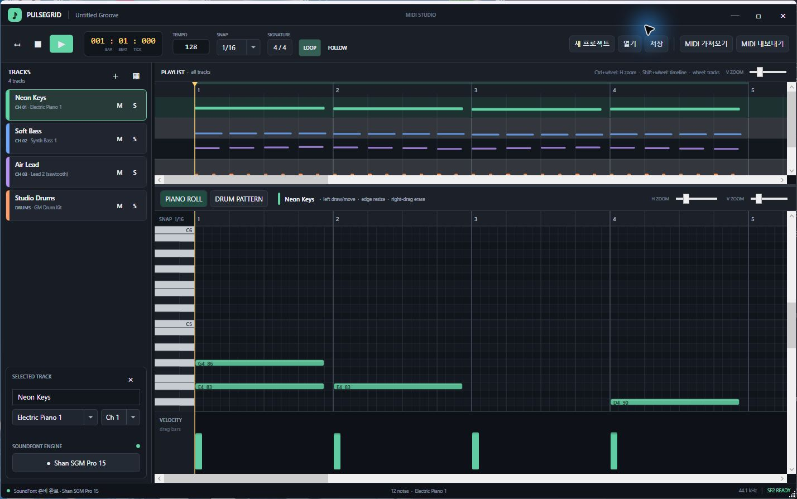

  
  
<strong>아이디어를 빠르게 연주 가능한 MIDI 트랙으로.</strong>

  
피아노 롤, 플레이리스트, 드럼 시퀀서가 한 화면에 담긴 Windows용 MIDI 편집기입니다.

## 주요 기능

- **한 화면 멀티트랙 작업** — 트랙별 악기·채널·색상과 Mute/Solo를 설정하고 곡 전체 구성을 한눈에 확인할 수 있습니다.
- **직관적인 피아노 롤** — 클릭과 드래그로 노트를 만들고, 이동하고, 길이와 벨로시티를 다듬을 수 있습니다.
- **드럼 스텝 시퀀서** — General MIDI 드럼 악기를 빠르게 탐색하며 리듬을 그리듯 입력할 수 있습니다.
- **SoundFont 재생** — 보유한 General MIDI 호환 `.sf2` 파일로 편집 중인 음악을 바로 들어볼 수 있습니다.
- **MIDI 및 프로젝트 파일** — 멀티트랙 `.mid` 파일을 가져오거나 내보내고, 작업을 `.pulsegrid` 프로젝트로 저장할 수 있습니다.
- **편집 도구** — 실행 취소/다시 실행, Snap, 확대·축소, 루프 재생과 퀀타이즈를 지원합니다.

## 시작하기

1. [Releases](../../releases)에서 최신 `PulseGrid-windows-x64.zip`을 받습니다.
2. ZIP 파일의 압축을 푼 뒤 `PulseGrid.exe`를 실행합니다.
3. 왼쪽 아래 **SF2 불러오기**에서 보유한 General MIDI 호환 SoundFont(`.sf2`)를 선택합니다.
4. 예제 곡이 필요하면 저장소의 `PulseGridDemo.pulsegrid`를 **열기**로 불러옵니다.

> PulseGrid는 Windows 10/11을 지원합니다. SoundFont는 라이선스 문제를 피하기 위해 앱에 포함되어 있지 않습니다.

## 기본 조작

| 조작 | 기능 |
|---|---|
| 빈 피아노 롤에서 좌클릭 후 드래그 | 노트 생성 및 길이 지정 |
| 노트 몸통 드래그 | 시간 및 음정 이동 |
| 노트 오른쪽 가장자리 드래그 | 노트 길이 조절 |
| 노트 또는 드럼 스텝 우클릭 | 삭제 |
| 드럼 그리드에서 좌클릭 후 드래그 | 스텝 연속 입력 |
| 하단 Velocity 막대 드래그 | 벨로시티 조절 |
| `Space` | 재생 / 일시정지 |
| `Home` | 정지 후 처음으로 이동 |
| `L` | 루프 켜기 / 끄기 |
| `Tab` | 피아노 롤 / 드럼 패턴 전환 |
| `Ctrl+Z` / `Ctrl+Y` | 실행 취소 / 다시 실행 |
| `Ctrl+S` | 프로젝트 저장 |
| `Ctrl+휠` | 가로 확대 / 축소 |
| `Alt`를 누른 채 편집 | Snap 임시 해제 |

피아노 롤에서는 `Delete`, `Ctrl+A`, `Ctrl+D`, `Q`(퀀타이즈)도 사용할 수 있습니다. 드럼 편집기에서는 마우스 휠로 악기 행을 탐색하고, `Shift+휠`로 타임라인을 이동할 수 있습니다.

## 지원 파일

| 형식 | 용도 |
|---|---|
| `.pulsegrid` | 편집 가능한 PulseGrid 프로젝트 저장 및 열기 |
| `.mid` / `.midi` | 멀티트랙 MIDI 가져오기 및 내보내기 |
| `.sf2` | 악기 및 드럼 소리 재생 |

---

음악에 집중할 수 있는 빠르고 간결한 MIDI 작업 공간.

